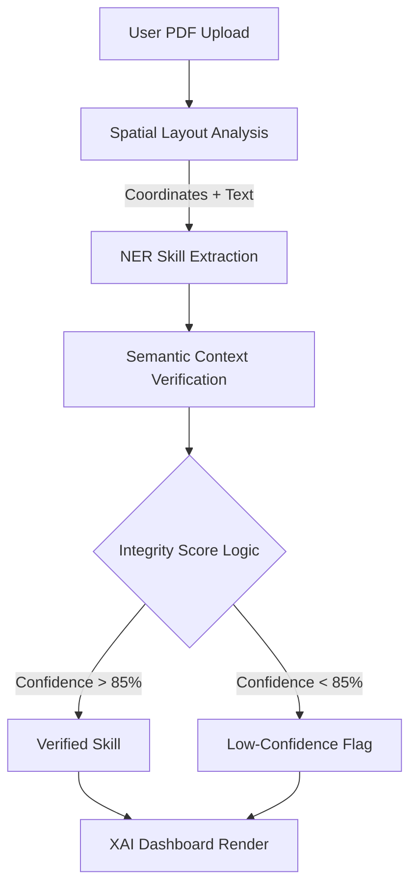

# SkillExtract AI (TRL-4+ Prototype)

SkillExtract AI is a **production-oriented resume intelligence system** designed to reduce hallucination risk in recruitment AI by combining **layout-aware parsing + semantic verification + explainable weighted scoring**.

## Invention Disclosure (Patent-Oriented)

### Technical Problem
Conventional recruitment AI systems rely on static keyword matching. This creates false positives (hallucinated skills) and false negatives (valid skills ignored due to formatting or section placement), especially in complex PDF resumes.

### Technical Solution: Spatial-Semantic Synthesis
SkillExtract AI introduces a hybrid verification pipeline:
1. **Coordinate-aware parsing** extracts words with `(x, y)` layout coordinates.
2. **Semantic verification** uses a BERT-style cross-encoder to verify whether each extracted skill is contextually grounded in nearby text.
3. **Weighted scoring** incorporates semantic confidence and layout importance for final ranking.

This architecture creates auditable, explainable evidence for every skill assertion.

## System Flow Diagram



## Mathematical Specification

Primary backend ranking metric:

\[
S_{final} = \sum (Importance \times Confidence \times SpatialWeight)
\]

Patent-focused normalized metric:

$$
Score_{Total} = \frac{\sum_{i=1}^{n} (W_{skill} \cdot V_{context} \cdot L_{layout})}{\text{Total Required Skills}}
$$

Where:
- $W_{skill}$: global importance of the skill relative to job requirements.
- $V_{context}$: semantic similarity between skill and surrounding context.
- $L_{layout}$: spatial significance weight (e.g., Header = 1.0, Footnote = 0.2).

## Architecture

### Backend (FastAPI + Transformers)
- `spatial_parser.py`: PDF text extraction with coordinates via `pdfplumber`.
- `verifier_engine.py`: cross-encoder semantic proof scoring with resilient fallback.
- `patent_ranking.py`: formalized weighted skill ranking engine.
- Strict request/response schemas via `pydantic`.

### Frontend (React + Tailwind + Framer Motion)
- **X-Ray Resume Viewer**: `react-pdf` rendering with confidence-colored overlays.
- **Integrity Dashboard**:
  - Match Accuracy Gauge
  - Verification Evidence cards
  - Skill-Gap Radar (`recharts`) candidate vs JD
- Glassmorphism UI with interactive motion components.

## Quick Start

### Backend
```bash
cd careerwise-ai-main/backend
pip install -r requirements.txt
python server.py
```

API: `POST /analyze` with multipart fields:
- `resume` (PDF)
- `job_skills` (comma-separated list)

### Frontend
```bash
cd careerwise-ai-main/frontend
npm install
npm start
```

## TRL-4 Validation Objective
This repository implements and demonstrates integrated subsystem validation in a realistic environment (resume parsing + verification dashboard), aligned with **TRL-4+** expectations.
