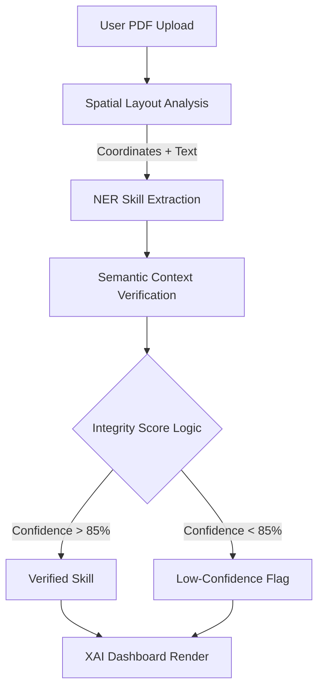

# SkillExtract AI — Spatial-Semantic Verification System (TRL-4+)

SkillExtract AI is a full-stack recruitment intelligence platform designed to reduce **hallucination risk** in resume screening. It combines:
- **Coordinate-aware PDF parsing** (layout structure awareness),
- **Semantic cross-verification** (skill-to-context validation),
- **Explainable weighted ranking** (confidence + layout significance).

This repository is structured to support both practical deployment and patent-style technical disclosure.

---

## 1) Patent-Oriented Invention Disclosure

### Technical Problem
Conventional recruitment AI pipelines over-rely on static keyword matching. This introduces:
- False positives (hallucinated skill matches),
- False negatives (skills hidden by formatting/layout),
- Lack of explainability for hiring decisions.

### Technical Solution: Spatial-Semantic Synthesis
SkillExtract AI introduces a layered verification architecture:
1. Parse PDF words with `(x, y)` coordinates and infer section role (`header/body/footer`).
2. For each candidate skill, validate against surrounding context (50-word window).
3. Score and rank using context confidence and layout-aware weighting.
4. Expose evidence in an interactive X-Ray UI (reasoning cards + confidence overlays).

This gives the system a concrete technical character beyond abstract keyword filtering.

---

## 2) System Flow Diagram (Mermaid)



---

## 3) Mathematical Specification

### Core Ranking Formula
\[
S_{final} = \sum (Importance \times Confidence \times SpatialWeight)
\]

### Inventive Step / Patent Formula
$$
Score_{Total} = \frac{\sum_{i=1}^{n} (W_{skill} \cdot V_{context} \cdot L_{layout})}{\text{Total Required Skills}}
$$

Where:
- $W_{skill}$: global importance of each skill from job requirements,
- $V_{context}$: semantic similarity between skill mention and local textual context,
- $L_{layout}$: spatial significance from layout position (e.g., Header = 1.0, Footer = 0.2).

---

## 4) Architecture

## Backend (FastAPI + Transformers)

### `app/services/spatial_parser.py`
- Uses `pdfplumber` to extract tokens and geometry.
- Assigns section classes by vertical position.
- Produces context windows for semantic proofing.

### `app/services/verifier_engine.py`
- Cross-encoder style semantic scoring (Transformers/Torch).
- Safe fallback similarity when model loading is unavailable.
- Produces human-readable reasoning evidence.

### `app/services/patent_ranking.py`
- Implements weighted ranking formula.
- Returns per-skill weighted score and global total.

### `app/main.py`
- `/health` service probe endpoint.
- `/analyze` endpoint for multipart PDF + job skills.
- Includes robust validation and explicit PDF parse failure handling.
- CORS enabled for frontend/backend local integration.

## Frontend (React + Tailwind + Framer Motion)

### X-Ray Resume Viewer
- `react-pdf` rendering with confidence overlays.
- Overlay color semantics:
  - Green: high confidence,
  - Yellow: needs review,
  - Red: low confidence.

### Integrity Dashboard
- Match accuracy indicator,
- Clickable evidence cards with reasoning,
- Radar skill-gap visualization (`recharts`),
- Interactive states for upload/analyze/error/result.

### UI/UX
- Dark glassmorphism cards,
- Gradient hero shell,
- Improved typography using Inter,
- Animated transitions.

---

## 5) API Contract

### `GET /health`
Returns service heartbeat:
```json
{ "status": "ok", "service": "SkillExtract AI" }
```

### `POST /analyze`
Multipart form-data:
- `resume`: PDF file
- `job_skills`: comma-separated string (`Python,FastAPI,React,...`)

Error behavior includes:
- non-PDF uploads,
- empty uploads,
- unreadable/scanned PDFs with no extractable text,
- parser failures surfaced with meaningful details.

---

## 6) Local Setup

### Backend
```bash
cd careerwise-ai-main/backend
pip install -r requirements.txt
python server.py
```
Server starts on `http://0.0.0.0:8000`.

### Frontend
```bash
cd careerwise-ai-main/frontend
npm install
npm start
```
Dev app starts on `http://localhost:3000`.

Optional API base URL override:
```bash
# .env in frontend/
REACT_APP_API_BASE_URL=http://localhost:8000
```

---

## 7) Troubleshooting

### Runtime error: `Failed to fetch dynamically imported module ... pdf.worker.min.js`
If you encounter PDF worker load errors:
- Ensure internet access for worker CDN URL,
- Hard refresh browser cache,
- Confirm no corporate proxy blocks CDN worker files,
- Verify `react-pdf` and `pdfjs-dist` versions remain compatible.

### PDF uploads fail
- Use a **text-based** PDF (not image-only scan),
- Check backend is running and reachable,
- Verify CORS/network path between `localhost:3000` and `localhost:8000`.

### Model download delay
First launch may take longer if transformer weights are downloaded.

---

## 8) TRL-4+ Positioning
This implementation validates integrated subsystems in a relevant environment:
- Coordinate extraction,
- Semantic verification,
- Weighted ranking,
- Explainable human-in-the-loop visualization.

This aligns with TRL-4+ expectations for prototype-level technical feasibility.
