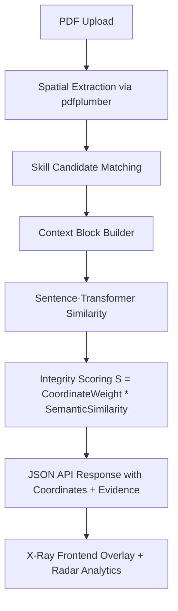

# SkillExtract: High-Integrity Resume Intelligence System

SkillExtract is a production-focused full-stack system for hallucination-resistant recruitment intelligence. It combines PDF spatial layout understanding with semantic verification to produce verifiable, auditable skill evidence.

## Patent Disclosure

### Technical Problem
Legacy resume parsers rely on plain keyword matching and often misclassify candidate capability:
- false positives from isolated terms,
- false negatives from layout-heavy resumes,
- weak evidence trails for human reviewers.

### Novelty: Spatial-Semantic Mapping
SkillExtract introduces a verifiable mapping between:
1. **Where** a skill appears in a document (coordinates and section weight), and
2. **Why** that skill is credible (semantic similarity with local context).

This spatial-semantic synthesis provides technical behavior beyond abstract scoring.

## System Flow (Mermaid)



## Mathematical Formulation

Core integrity score per skill:

\[
S = \text{CoordinateWeight} \times \text{SemanticSimilarity}
\]

Where:
- `CoordinateWeight` is derived from document section (`header/body/footer`),
- `SemanticSimilarity` is cosine similarity from `all-MiniLM-L6-v2` (normalized to `[0,1]`).

Returned confidence uses the exact integrity score:

\[
Confidence_{skill} = S
\]

## Repository Layout

```text
/backend
  /app
    config.py
    main.py
    schemas.py
    /services
      spatial_extractor.py
      contextual_verifier.py
  requirements.txt
  server.py
  .env.example

/frontend
  index.html
  package.json
  vite.config.js
  tailwind.config.js
  postcss.config.js
  .env.example
  /src
    main.jsx
    App.jsx
    index.css
    /components/ui
      button.jsx
      card.jsx
      badge.jsx
    /lib
      utils.js
```

## Backend (FastAPI)

### Endpoint
`POST /analyze` (multipart form-data):
- `resume`: PDF file
- `job_skills`: comma-separated list (optional; defaults from env)

### Response payload
Each detected skill includes:
- `skill`
- `coordinates` (`x0,y0,x1,y1,page,page_width,page_height`)
- `confidence_score`
- `semantic_similarity`
- `coordinate_weight`
- `evidence_snippet`

### Environment configuration
Copy `backend/.env.example` to `backend/.env` and adjust:
- `APP_NAME`
- `APP_VERSION`
- `CORS_ORIGINS`
- `SEMANTIC_MODEL_NAME`
- `DEFAULT_REQUIRED_SKILLS`
- `CONTEXT_WINDOW_SIZE`

## Frontend (React + Vite)

### UI/UX stack
- Tailwind CSS glassmorphism theme
- Inter + JetBrains Mono typography
- Framer Motion stagger animations
- React-PDF rendering
- SVG coordinate overlays for X-Ray bounding boxes
- Recharts radar chart for skill-density by domain
- Shadcn-style reusable UI primitives (`Button`, `Card`, `Badge`)

### Environment configuration
Copy `frontend/.env.example` to `frontend/.env` and adjust:
- `VITE_API_BASE_URL`

## Local Development

### 1) Backend
```bash
cd backend
pip install -r requirements.txt
python server.py
```

### 2) Frontend
```bash
cd frontend
npm install
npm run dev
```

## Production Notes
- Ensure model cache/network availability for first-time Sentence-Transformer download.
- For scanned PDFs with no embedded text, OCR preprocessing is recommended before upload.
- Keep `CORS_ORIGINS` restricted in production.

## TRL-4+ Positioning
The system validates integrated subsystems in a relevant environment:
- spatial text extraction,
- semantic cross-validation,
- deterministic scoring,
- explainable human-review UI.

This supports patent-ready technical disclosure and practical hiring-assist workflows.
